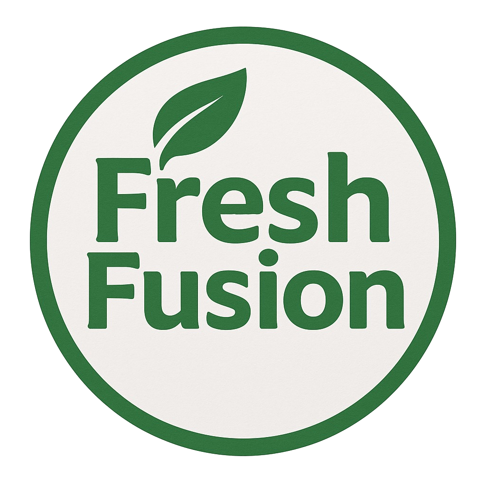

    

    
    
Fresh Fusion

    

    
A Fresh Way to Thrive

    

Marketing project idea by the <b>Best</b> group for the <b>MGCR 352</b> course. McGill University.

<h3>
Group Members
</h3>

- Emily Lim

- Asley Robleto

- Oleksandr Stashkiv

- Maya Dattani

- Roy Elia

- Sandra Kamel

- Caroline Zhu

<h2>
Product Summary
</h2>

Fresh Fusion delivers 100% freshly pressed, customizable fruit juices using an automated juicing machine as its distribution channel, offering pure, additive-free drinks made on the spot. Targeting health-conscious consumers, families, convenience seekers, and tech-curious users, the brand blends freshness, speed, and innovation to make healthy choices simple, transparent, and enjoyable.

<h2>
Mobile App Mockup
</h2>

Meant for a possible Fresh Fusion's mobile app concept. Lacking any kind of non-mobile style responsiveness and functionality.

Initial HTML and CSS layout developped by Claude AI. Minor text, HTML, and CSS modifications by <b>Asley Robleto</b>, with very valuable help from Emily Lim.

<h2>
License
</h2>

Both this repository and the Fresh Fusion project concept developed fall under the <b>GNU</b> general public license.

Click here to see the <a href="./LICENSE">License</a>.
